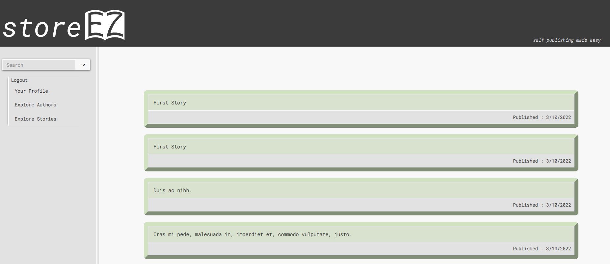
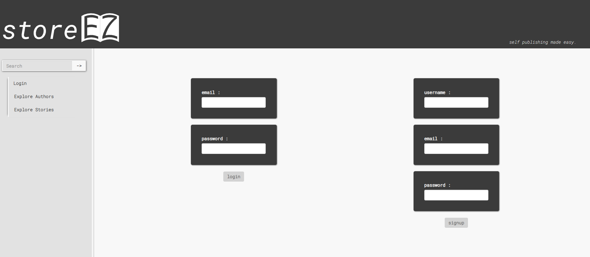
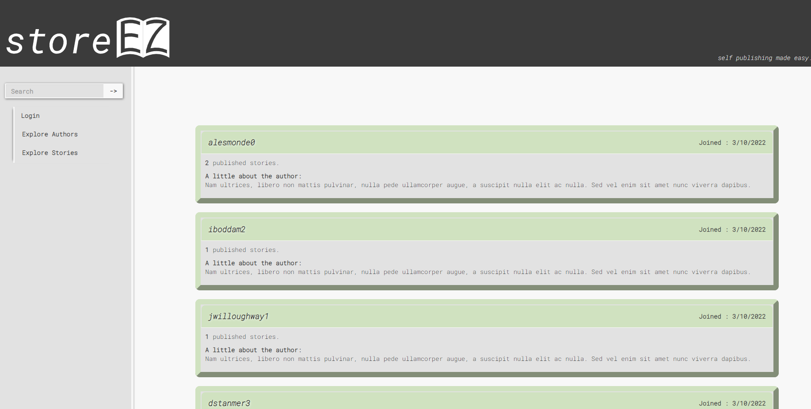

# STORE EZ 

## Project Summary
As a team we have found that there is a need for an easy and well maintained platform for aspiring authors to post their content. As such our team aims to develop an application to allow users to self publish their written material. 
We will provide users with the ability to create accounts, login, privately store their works, and publicly publish their works. Additionally, we wish to include bookmark features and the ability for readers and authors to leave comments. 

Launched Website: https://store-ez.herokuapp.com/ 
...

## Developers

1. Dita Zanelli 

2. Jaime Gallegos Garcia 

3. Autumn Barrios

## Installation Instructions

- Launch via Horoku 

- Clone repository, download dependencies, generate database using Schema.sql, seed the database with the provided seed files, and start the server using node. 

## Animated Gifs/Pictures of App

## Tech Stack

- Languages: HTML, CSS, JavaScript  

- What libraries are used: Express, Node, MySql, Sequelize, P5.js, Dotenv, Handlebars, and Bootstrap. 

- Other: Launched using Heroku in conjunction with Jawsdb. 

## APIs

- N/A

## MVP (Minimum Viable Product)

- An application that allows users to login and logout. Store written content as publish stories. There will be the option for logged in users to leave comments. There will be 4 main featured pages, a homepage for looking through all published works, a page for viewing another authors page, a profile for writing stories and generating book covers, as well as a login/logout page. 

## Stretch Goals

- The ability to save and browse using chapters. 
- A more intuitive book cover generator. 
- Search functionality 
- Reply to other comments
- Fix disconnect between cover and story creations. 
